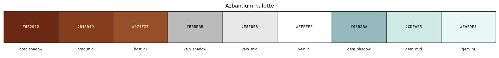

# Palette — Azbantium

Family id: `azbantium`

Map colour: `COLOR_LIGHT_BLUE`

Gallifrey-stone host with silver/white ore veins; storage block is pale icy cyan. Map colour is light blue for the mineral family.

| Role | Hex | Notes |
|------|-----|-------|
| `host_shadow` | `#6B2912` | Gallifrey stone darkest |
| `host_mid` | `#843D1D` | Gallifrey stone primary fill |
| `host_hi` | `#974F27` | Gallifrey stone highlight |
| `vein_shadow` | `#BBBBBB` | Silver ore inclusion |
| `vein_mid` | `#E8E8E8` | Silver ore mid |
| `vein_hi` | `#FFFFFF` | Silver ore highlight |
| `gem_shadow` | `#95B8BA` | Storage block shadow (icy cyan) |
| `gem_mid` | `#CDEAE5` | Storage block body |
| `gem_hi` | `#EAF9F5` | Storage block highlight |

Source JSON: [`azbantium.json`](./azbantium.json). Regenerate with `tools/generate_family_palette_docs.py` (from `dwm/`: `--palette docs/palettes/<id>.json --out-dir docs/palettes`).
