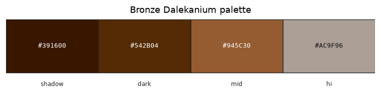

# Palette — Bronze Dalekanium

Family id: `bronze_dalekanium`

Seed: `#945C30` · Profile: `mineral`

Map colour: `COLOR_ORANGE`

Warm copper-bronze Dalekanium alloy (dalekanium + copper) for Skaro architecture and ingots. Use as the mineral/metal slot on ingot and architecture sprites.

Step hexes below are **generated** from the seed and named contrast profile (not hand-authored).

| Role | Hex | Notes |
|------|-----|-------|
| `shadow` | `#391600` |  |
| `dark` | `#542B04` |  |
| `mid` | `#945C30` |  |
| `hi` | `#AC9F96` |  |

Source JSON: [`bronze_dalekanium.json`](./bronze_dalekanium.json). Regenerate with `poetry -C dwm/tools/palette run generate-family-palette-docs` (from repo root: `--palette dwm/docs/palettes/<id>.json --out-dir dwm/docs/palettes`).
