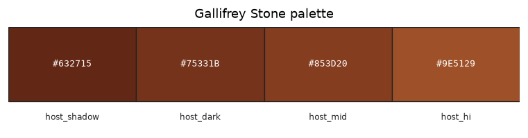

# Palette — Gallifrey Stone

Family id: `gallifrey_stone`

Map colour: `TERRACOTTA_ORANGE`

Canonical Gallifrey stone host atlas from gallifrey_stone.png. Shared by Gallifrey vanilla ores (coal, iron, gold, diamond). Zeiton and Azbantium ore hosts are near-miss browns and are not this palette.

| Role | Hex | Notes |
|------|-----|-------|
| `host_shadow` | `#632715` | Darkest stone flecks |
| `host_dark` | `#75331B` | Dark mid tone |
| `host_mid` | `#853D20` | Primary stone fill |
| `host_hi` | `#9E5129` | Stone highlight |

Source JSON: [`gallifrey_stone.json`](./gallifrey_stone.json). Regenerate with `tools/generate_family_palette_docs.py` (from `dwm/`: `--palette docs/palettes/<id>.json --out-dir docs/palettes`).
