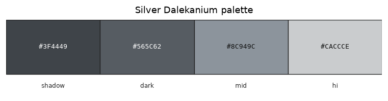

# Palette — Silver Dalekanium

Family id: `silver_dalekanium`

Seed: `#8C949C` · Profile: `mineral`

Map colour: `COLOR_LIGHT_GRAY`

Cool bright silver Dalekanium alloy (dalekanium + iron) for Skaro architecture and ingots. Lighter than steel; use as the mineral/metal slot on ingot and architecture sprites.

Step hexes below are **generated** from the seed and named contrast profile (not hand-authored).

| Role | Hex | Notes |
|------|-----|-------|
| `shadow` | `#3F4449` |  |
| `dark` | `#565C62` |  |
| `mid` | `#8C949C` |  |
| `hi` | `#CACCCE` |  |

Source JSON: [`silver_dalekanium.json`](./silver_dalekanium.json). Regenerate with `poetry -C dwm/tools/palette run generate-family-palette-docs` (from repo root: `--palette dwm/docs/palettes/<id>.json --out-dir dwm/docs/palettes`).
