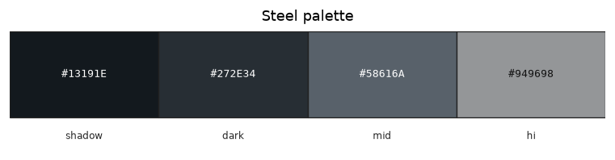

# Palette — Steel

Family id: `steel`

Seed: `#58616A` · Profile: `mineral`

Map colour: `COLOR_GRAY`

Dark silvery-grey metal for ingots and tool heads. Cooler and darker than vanilla iron mid greys; use as the mineral/metal slot on ingot, pickaxe, and sword products.

Step hexes below are **generated** from the seed and named contrast profile (not hand-authored).

| Role | Hex | Notes |
|------|-----|-------|
| `shadow` | `#13191E` |  |
| `dark` | `#272E34` |  |
| `mid` | `#58616A` |  |
| `hi` | `#949698` |  |

Source JSON: [`steel.json`](./steel.json). Regenerate with `poetry -C dwm/tools/palette run generate-family-palette-docs` (from repo root: `--palette dwm/docs/palettes/<id>.json --out-dir dwm/docs/palettes`).
