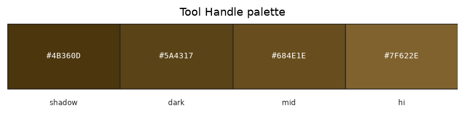

# Palette — Tool Handle

Family id: `tool_handle`

Seed: `#684E1E` · Profile: `stone`

Map colour: `TERRACOTTA_BROWN`

Oak-stick wood browns for tool handles. Seed matches the mid of vanilla stick.png; used as the handle slot on pickaxe and sword products.

Step hexes below are **generated** from the seed and named contrast profile (not hand-authored).

| Role | Hex | Notes |
|------|-----|-------|
| `shadow` | `#4B360D` |  |
| `dark` | `#5A4317` |  |
| `mid` | `#684E1E` |  |
| `hi` | `#7F622E` |  |

Source JSON: [`tool_handle.json`](./tool_handle.json). Regenerate with `poetry -C dwm/tools/palette run generate-family-palette-docs` (from repo root: `--palette dwm/docs/palettes/<id>.json --out-dir dwm/docs/palettes`).
