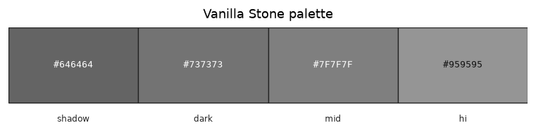

# Palette — Vanilla Stone

Family id: `vanilla_stone`

Seed: `#7F7F7F` · Profile: `stone`

Map colour: `STONE`

Overworld stone host for Skaro ores. Seed is the mid grey of vanilla stone.png so emerald-ore remaps keep a vanilla host.

Step hexes below are **generated** from the seed and named contrast profile (not hand-authored).

| Role | Hex | Notes |
|------|-----|-------|
| `shadow` | `#646464` |  |
| `dark` | `#737373` |  |
| `mid` | `#7F7F7F` |  |
| `hi` | `#959595` |  |

Source JSON: [`vanilla_stone.json`](./vanilla_stone.json). Regenerate with `poetry -C dwm/tools/palette run generate-family-palette-docs` (from repo root: `--palette dwm/docs/palettes/<id>.json --out-dir dwm/docs/palettes`).
