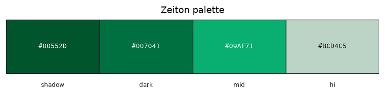

# Palette — Zeiton

Family id: `zeiton`

Seed: `#09AF71` · Profile: `mineral`

Map colour: `TERRACOTTA_ORANGE`

Emerald/teal mineral. Gallifrey ores use this as the mineral on gallifrey_stone (vanilla emerald-ore template). Map colour follows the Gallifrey ore host (terracotta orange), not the green veins.

Step hexes below are **generated** from the seed and named contrast profile (not hand-authored).

| Role | Hex | Notes |
|------|-----|-------|
| `shadow` | `#00552D` |  |
| `dark` | `#007041` |  |
| `mid` | `#09AF71` |  |
| `hi` | `#BCD4C5` |  |

Source JSON: [`zeiton.json`](./zeiton.json). Regenerate with `poetry -C dwm/tools/palette run generate-family-palette-docs` (from repo root: `--palette dwm/docs/palettes/<id>.json --out-dir dwm/docs/palettes`).
